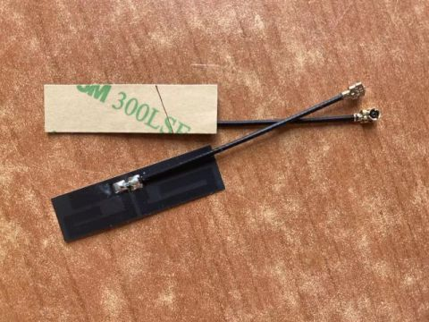
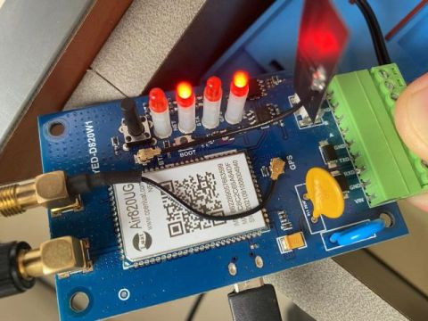
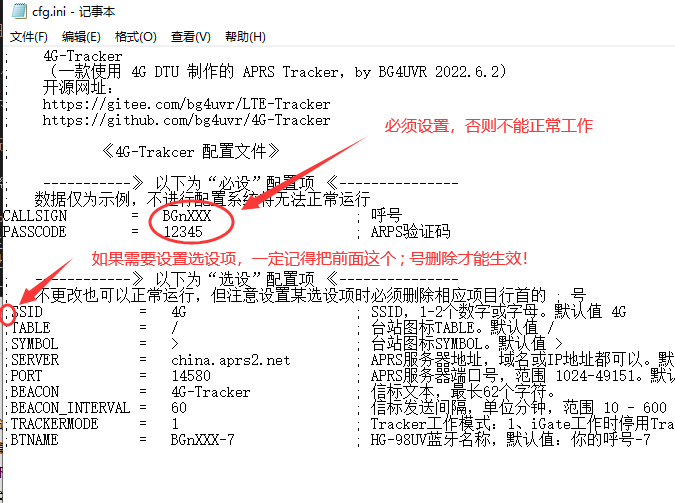
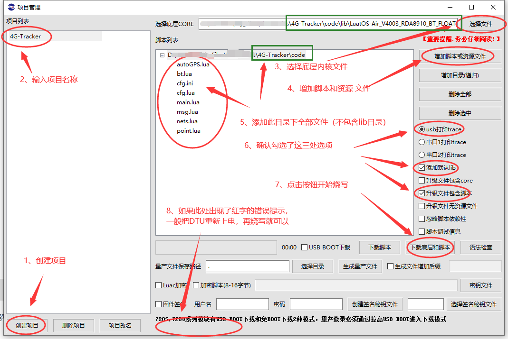

# 4G-Tracker 制作步骤

## 首先声明一下

如按本文的介绍进行制作，默认您已明确知晓并同意以下各项内容：

* 本制作只适合有合法手续的业余无线电爱好者，在遵守相关法律法规的前提下使用。
* 使用或通过修改代码使用本装置时，配置的相关参数需要严格遵守APRS系统相关规则。
* 制作者需要自行对因按本文制作而产生的各种后果负责，包括但不限于发生危险或发生法律纠纷。
* 本人与文中涉及到相关硬件产品厂商与无任何关系，不承担任何负责。

---

## 制作步骤

* 2022.9.22 [BG4UVY专门录制了一个说明视频](https://www.bilibili.com/video/BV1fd4y1B7Kc/) （视频录制时，代码为v0.0.31版本，在v0.0.32版本以后，因为代码目录结构调整、代码分拆，所以相关目录与文件状态与视频中不同，请注意）

1. 我所使用的DTU的详细型号为 **深圳银尔达** 公司生产的 **YED-D820W1** 型4G DTU（内部核心为上海合宙生产的 **Air820UG** 模块，该模块集成了DTU、蓝牙和定位功能）。理论上，本资料也适合在其他各种使用Air820UG模块制作的DTU或开发板上来实现。

2. 因为我们要使用蓝牙功能，而该DTU内部默认没有安装蓝牙天线，所以我们先需要自行购买一个蓝牙天线装上（如果你不用iGate功能可以不装）

   蓝牙天线的样子：

   

   安装到DTU电路板上的状态：

   

   然后再分别接好4G和GPS天线，将SIM卡装入DTU的卡槽，外接5-36V直流电源即可（正负极分别连接到模块的VIN和GND端口，注意不要搞错啦~）。

3. 下载本代码，直接点击“克隆/下载”，选择“下载ZIP”来下载文件，下图是Gitee网站的，github网站也是类似操作。

   

   ZIP文件下载完成后，先解压缩。其中doc目录为说明文件，code目录下为程序代码，进入code目录，修改“cfg.ini”文件，其中呼号和验证码是必设选项，不设置将无法工作。其他参数均为选设项，即使不做修改，系统也可以很正常地工作。

   

   其实如果下载个 NotePad++ 软件来编辑这些文本，因为有高亮显示会方便得多，不容易出错

4. 下载厂家硬件驱动程序

   [合宙Cat.1模块PC 端 USB 驱动](https://cdn.openluat-luatcommunity.openluat.com/attachment/20200808183454135_sw_file_20200303181718_8910_module_usb_driver_signed%20_20200303_hezhou.7z)

   下载好后解压缩，根据自己电脑系统情况选择安装，完成后插入USB线连接DTU模块（**注意：模块的USB接口只有数据通信功能，并不能用来给模块供电，供电需要在VIN和GND端口专门外接**），观察设备管理器中没有无法识别的硬件就说明驱动已经正常工作了。

5. 下载厂家的固件烧写工具

   [Luat下载调试工具v2](https://luatos.com/luatools/download/last)

   双击文件运行，此时软件会提示有更新，点击“开始”来更新资源文件，更新完成后，需要手动点击“取消”来关闭更新窗口。注意：**软件首次运行时，需要在线更新资源文件，必须联网**，否则会因为没有资源文件而不能正常工作。

   

6. 烧写luat脚本：

   * 打开Luatools，点击右侧的“项目管理测试”

   * 在新弹出的窗口中，点击左下角的“新建项目”，项目名称可以输入“4G-Tracker”(其他名称也可以)

   * “选择底层CORE”，右侧点击“选择文件”，选择第3步解压文件夹下“code\lib\”目录中的“LuatOS-Air_V4003_RDA8910_BT_FLOAT.pac”文件，点击“打开”

   * “脚本列表”右侧，点击“增加脚本和资源文件”，选择第3步解压文件夹下code目录中所有的文件（不包含lib目录），点打开

   * 给DTU上电，然后点击右侧的“下载底层和脚本”

   

   烧写过程大约不到一分钟即可结束，成功后软件界面会有绿色文字提示，如果出现红字的错误提示，一般把DTU重新上电再烧写就可以成功。如果重新上电也不能烧写，那么需要在DTU断电状态下，按住主板上的BOOT按钮上电，再烧写即可成功。

---

## 错误排查

一般情况下只要配置文件没有错误，烧写完成后应该就能正常运行了，此时可以查看Luatools软件的调试窗口中输出的相关信息，用来确认当前的工作状况，同时这些信息也可以用来判断产生错误的原因。
