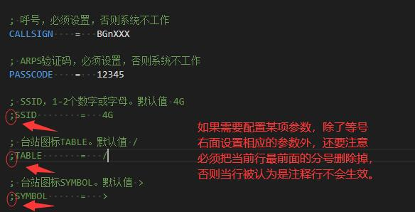
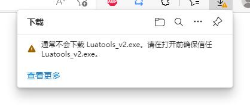
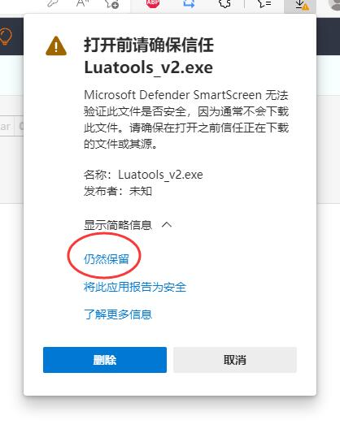
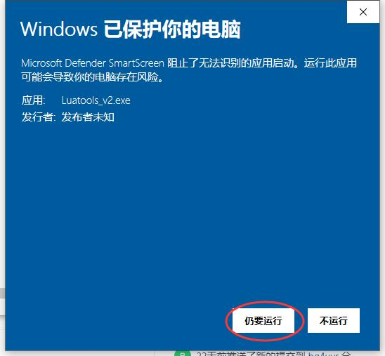
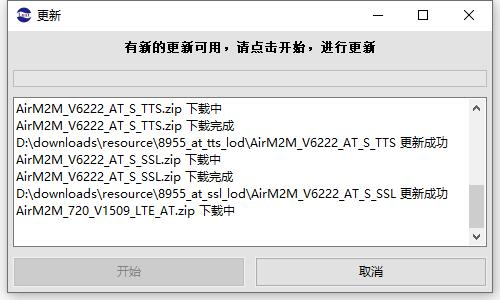
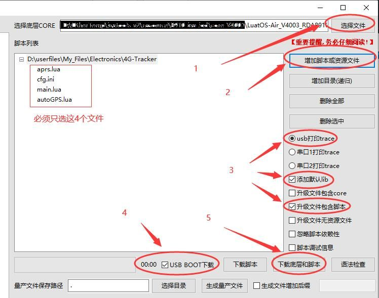

# 4G-Tracker

---

## 简介

这是一款通过使用商品化DTU进行二次开发，来制作的专门用于业余无线电爱好者发送APRS消息的装置，简单命名为 **4G-Tracker**。

本制作的特点：

使用商品DTU，硬件零改动；价格便宜，100多块；流量消耗很少（平均约150KB/天）；DTU为4G频段的三网通用；固件支持空中升级；动态发点（非定时发点）。

这个DTU的样子如下图，体积还算小巧


再来正面原图，方便大家确定准确的型号


本资料在 Gitee 和 github 两个网站同步更新，网址如下：

<https://gitee.com/bg4uvr/LTE-Tracker> （国内建议使用）

<https://github.com/bg4uvr/4G-Tracker> （国内有时可能无法打开，或图片无法显示）

---

## 声明

如按本文的介绍进行制作，默认您已明确知晓并同意以下各项内容：

1. 本制作只适合有合法手续的业余无线电爱好者，在遵守相关法律法规的前提下使用，不符合本条件的制作需要自行承担一切后果。
2. 使用或通过修改代码使用本装置时，配置的相关参数需要严格遵守APRS系统相关规则。
3. 本装置如用于车载将涉及到机动车电源线改接，制作者需要自行对可能产生各种危险情况自行负责。
4. 本人不对的代码可能存在在各种错误造成的结果负责。
5. 本人与文中涉及到的商品DTU、SIM卡的生产销售商无任何关系，文中的相关品牌与型号，均为介绍不构成推荐，不承担任何负责。

---

## 制作步骤

1. 我使用的DTU型号为 **深圳银尔达** 生产的 **YED-D820W1** 型4G DTU（内部核心为上海合宙生产的 **Air820UG** 模块），该DTU内置了定位功能（支持接收GPS、北斗卫星）。理论上，本资料也适合在其他各种使用Air820UG模块制作的DTU或开发板上来实现。

2. 硬件部分无任何改动，只要分别接好4G和GPS天线，再将SIM卡装入DTU的卡槽，外接5-36V直流电源（正负极分别连接到模块的VIN和GND端口）即可。 **如果是车载使用，强烈电源建议接在ACC端（通俗地说就是指钥匙打开后才有电的那组电源线），以免长期停车时耗尽蓄电池电量** 。

3. 下载本代码，共有两种方式。第一种是使用git命令进行克隆，这种方式略复杂就不介绍了。第二种是点击“克隆/下载”，选择“下载ZIP”来下载文件，下图是Gitee网站的，github网站也是类似操作。

   

   下载好ZIP文件后，解压缩好。**然后修改“cfg.ini”文件，其中呼号和验证码是必设选项，不设置将无法工作**。其他参数均为选设项，即使不做修改，系统也可以很正常地工作。

   

4. 下载

   [合宙Cat.1模块PC 端 USB 驱动](https://cdn.openluat-luatcommunity.openluat.com/attachment/20200808183454135_sw_file_20200303181718_8910_module_usb_driver_signed%20_20200303_hezhou.7z)

   并安装完成，插入USB线连接DTU模块（**注意：模块的USB接口只有数据通信功能，并不能用来给模块供电，供电需要在VIN和GND端口外接**），观察设备管理器中没有无法识别的硬件就说明驱动已经正常工作了。

5. 下载

   [Luat下载调试工具v2](https://luatos.com/luatools/download/last)

   安装步骤介绍一下：

   软件可能是因为没有数字证书的关系，在我的win10系统下EDGE浏览器会提示不安全，点击右侧的三个小点后选择“保留”即可

   

   

   双击文件点运行，仍然会有个提示，选择“仍然运行”（只有第一次需要，后面再打开就没有这个提示了）

   

   此时软件会提示有更新，点击“开始”来更新资源文件，更新完成后，需要手动点击“取消”来关闭更新窗口。注意：**软件首次运行时，需要在线更新资源文件，必须联网**，否则会因为没有资源文件而不能正常工作。

   

6. 烧写luat脚本：

   - 打开Luatools，点击右侧的“项目管理测试”

   - 在新弹出的窗口中，点击左下角的“新建项目”，项目名称可以输入“4G-Tracker”(其他名称也可以)

   - “选择底层CORE”，右侧点击“选择文件”，选择第2步解压文件夹下“pac”目录中的“LuatOS-Air_V4003_RDA8910_BT_FLOAT.pac”文件，点击“打开”

   - “脚本列表”右侧，点击“增加脚本和资源文件”，选择第2步解压文件夹下的3个“.lua”文件和1个“cfg.ini”文件。注意：不要多选和少选，一共选4个文件

   - 勾选“USB BOOT下载”，按住DTU主板上的BOOT按键，给DTU上电，然后点击右侧的“下载底层和脚本”

     

     烧写过程大约不到一分钟即可结束，至此DIY工作全部完成。

---

## 错误排查

脚本和配置文件写入后，无需再进行其他任何设置和操作，装置即可自动开始运行。如果没有拨掉连接电脑和DTU的USB电缆，那么Luatools软件的调试窗口中会输出相关运行状态信息，可以用来确认当前的工作状况，判断装置是否已经正常工作。

第一次使用lua语言编程，水平有限且代码未经长期运行测试，应该存在诸多不足甚至错误，如发现问题或有意见建议，欢迎留言交流和指导~

---

## 常见问题

提示：以下内容较为冗长，仅供深入了解，初次制作时无需关注

1. Q：cfg.ini 文件打开后，显示格式混乱怎么办？

   A：由于Git的关系，代码中采用的是linux系统下的LF换行符，而不是Windows系统的CRLF换行符，在旧版Windows系统中会因此无法正确显示换行。较简单的解决办法是下载一个 notepad++ 文本编辑软件，此软件支持LF、CRLF、CR换行符文件的正常显示及编辑。

2. Q：固件空中自动更新怎么用？

   A：当旧版本代码被发现存在错误而必须修正或是进行了重大更新时，我会发布远程更新固件。更新过程对用户来讲是完全无感的，不需要用户做任何设置与操作，远程更新不会覆盖您的个人配置，如果你开启了默认信标语句，那么更新后你将可以看到固件版本号发生了变化。更新的固件包大约40KB，一次远程固件更新，消耗总流量约180KB左右。普通新版本默认不发布空中更新，如果您想关闭本功能，可以在 aprs.lua 文件中搜索“```update.request()```”（只有一处），更改为“```-- update.request()```”即可。

   如果你并未关闭本功能但固件却无法自动更新，第一种原因是你的底包不是4003版本，此时重刷为4003版本的底包即可；第二种原因是你的DTU硬件在上海合宙平台已经被注册，你需要在平台上进行设备删除操作（如果你并没有注册过上海合宙账号，那请联系你的供货商帮你完成）。

3. Q：为什么底包直接使用了指定的4003版本，而不使用最新版本？

   A：两个原因，一是高版本底包在下载代码时会清除代码自己创建的文件，这样配置副本文件将会丢失而不方便我们调试代码；二是随着日后厂家对底包固件的更新，将会有很多不同的底包版本，远程固件更新功能将因此变得较为复杂，为了统一所以指定了特定的版本。

4. Q：刷好固件后，luatools窗口中只显示了少量消息（AT+CSQ/AT+CESQ之类），就没有任何反应了

   A：luatools软件工作在虚拟机中时，因为枚举USB设备延迟的原因，会造成部分调试信息未能显示，因而无法看到具体的出错消息，误以为系统失去响应，此时改用普通电脑即可正确显示。

5. Q：UDP模式服务器怎么用？有什么优缺点？

   A：本代码使用的UDP模式服务器是一种**非标准的**APRS服务器模式，本模式最早由BG6CQ发明并使用（此处如有错误请指正），并在以前的aprs.cn服务器上使用。如果打算使用这种UDP模式，必须要先找到支持该模式的APRS服务器，并填写在“cfg.ini”文件中 ``` SERVER = ``` 后面，然后再设置 ``` UDPMODE = 1 ```即可。自从BG6CQ关闭原aprs.cn后，此种模式的公开服务器基本上很难找到了，如果临时测试可以使用 185.143.220.242，端口14580。使用UDP模式的优点是可以大幅度节约流量，在本项目上预计可节约近50%左右，另外就是发送步骤简单速度更快；缺点是UDP是非可靠协议，传输中可能会发生丢包。

6. Q：有时上电后过了好几分钟才发出第一个坐标点，是什么原因？

   A：正常情况下，上电大约一分钟即可发出第一个点，如果远大于此时间，一般是GPS或网络信号不好造成的延迟。
