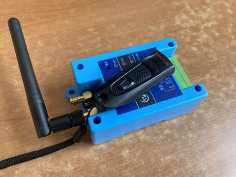

# 4G-Tracker

本资料在以下网址同步更新：

<http://gitee.com/bg4uvr/LTE-Tracker> (国内建议使用)

<http://github.com/bg4uvr/4G-Tracker>

## 介绍

这是一款使用商品化DTU，通过lua语言进行二次开发，来制作的APRS（自动位置报告系统）终端设备。换句话说，您买来这款DTU，刷入本代码就可以直接实现此功能，硬件完全不需要改动。初期只用它来完成了“Tracker”的功能，后来又增加了蓝牙连接HG-UV98对讲机支持，实现了“iGate”功能。

我的最初和最终目的，只是想做一个“功能简洁、运行稳定、成本低廉”的APRS设备，因此并没有增加任何其他功能计划。如果发现代码存在BUG欢迎反馈，但各种功能的改进、增加请勿向我提出，因精力有限此类问题无法一一回复，抱歉。

---

## [制作步骤](./doc/make.md)

## [常见问题](./doc/Q&A.md)

## [更新历史](./doc/history.txt)
